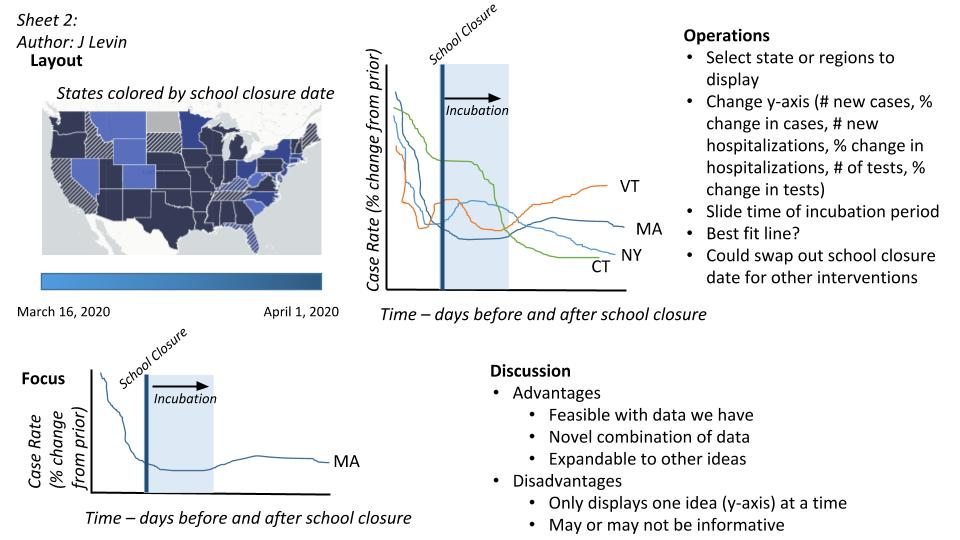
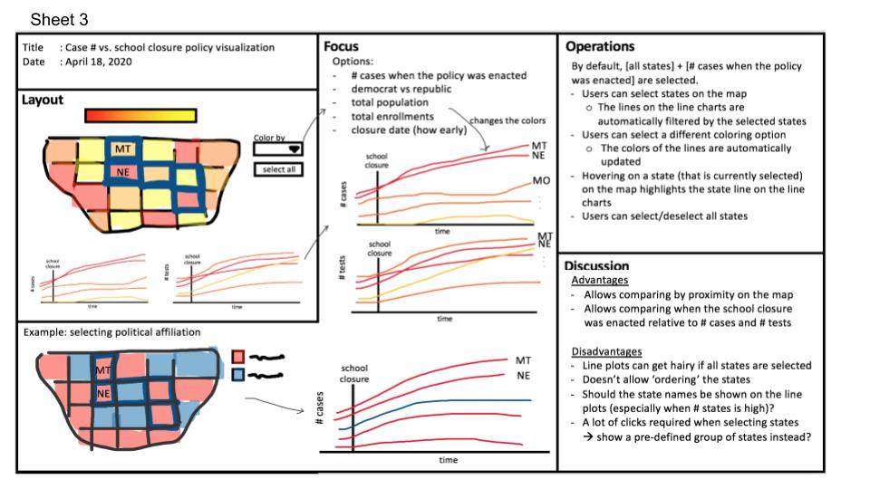
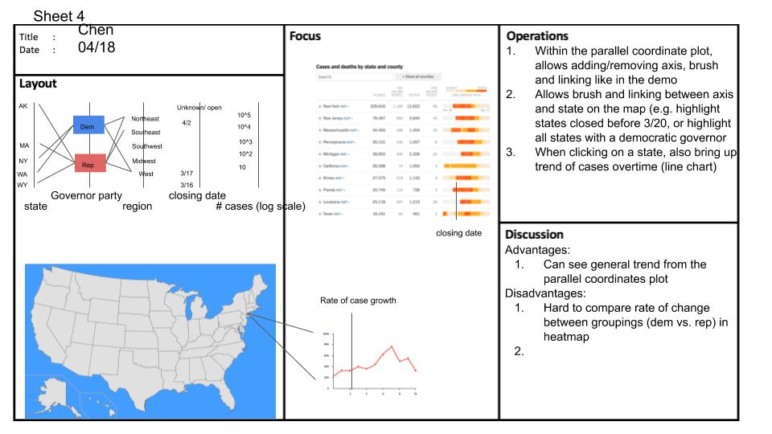
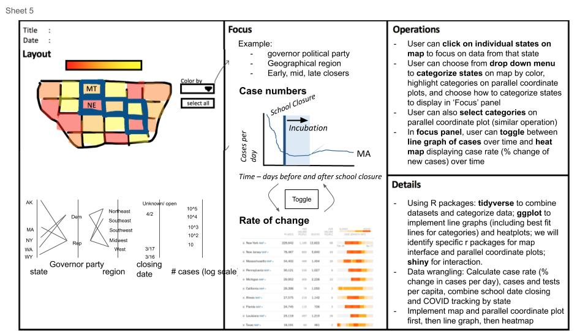

<center> 
# When did US states close their schools when the COVID pandemic hit?
</center>
<center>
## Visualizing the impact of testing, school policy closing and leadership government party on COVID-19 cases 
</center>


### Visualizations of COVID-19 and Coronavirus-related Data: 

First, we sought out other visualizations within public domains and from different outlets (including news sources, academic sources and blogs) in order to understand what aspects of COVID-19 data is already visualized. As expected, we found a lot of graphics focused on the epidemiological aspects of the pandemic. When we found a graphic on the impact of the pandemic on flight departures we began thinking of other impacts of the virus that we could explore. We sought to identify if there was any information that was not visualized already that would help create a fuller story of the effects of the pandemic.

We decided to look at policy impacts on the amount of COVID-19 cases a community experiences. We were able to find clean datasets for testing measures and school closures so we sought to visualize it to see if there may be an underlying relationship between whether a proactive or reactive public school state mandated closure or the number of tests a state runs and the number of  COVID-19 cases within the state. A visualization is necessary in this case because otherwise it would be difficult to illuminate if a relationship exists. We create this visualization for policy makers and evaluators who, for instance, decides when to enact school closures and for how long and further evaluate its effectiveness for future considerations. Our visualizations could also be used by public health researchers and the general public.


We expect to learn if the relationship exists and, if it does, to what extent the impact of these policies has on cases. We acknowledge that children are not as susceptible to COVID-19 as other risk groups and so there may not be a clear relationship between school closures and COVID-19 cases. Since this is an exploratory visual, we think that is valuable to create the visualization in order to let the data speak for itself.


### Dataset & Key Statistics

We combined data from several datasets: 

- State Historical Data in this COVID Tracking Project. Link: https://covidtracking.com/api”

This dataset contains daily updates from 56 states and territories on numbers of positive and negative COVID-19 tests and deaths from March 4 to current date (in total of 33 timepoints). Since 2020/03/16, every day 56 rows, each representing a US state or territory, are added to the existing dataset. 

- State-wide school closure enforcement date from Education Week. Link: https://www.edweek.org/ew/section/multimedia/map-coronavirus-and-school-closures.html 

This dataset is published by EduWeek.com, and regards status over time of school closings by district and then by state. 

- State governor’s political parties from The Henry J. Kaiser Family Foundation. Link: https://www.kff.org/other/state-indicator/state-political-parties/?currentTimeframe=0&sortModel=%7B%22colId%22:%22Location%22,%22sort%22:%22asc%22%7D 

This dataset is published by The Henry J. Kaiser Family Foundation and summarizes state-wide government for each US state.

- State population data (estimation for 2019) from the US Census Bureau. Link Census.gov 

This dataset is published by the US Census Bureau. It contains the estimation of population by state for the year of 2019.

### Merged Dataset Summary:

The first six rows of our merged dataset appears as follows:


```{r, error = FALSE,  warning=FALSE, echo=FALSE, results = 'hide', include = FALSE}
library(dplyr)
library(ggplot2)

dat.filt   <- read_csv('../data/filtered_data.csv')

dat.change <- read_csv('../data/fixed_data_percent_change.csv')

```

```{r, message = FALSE, warning = FALSE, echo = FALSE}
used <- c('state', 'date', 'positive', 'negative', 'total', 'death', 'Governor.Political.Affiliation', 'StateClosureStartDate', 'Region', 'POPESTIMATE2019', 'ClosureDateCat' )

dat.filt %>% select(used) %>% head()
```

Our merged dataset has the following columns and attributes:

        state [chr]: State abbreviation

        date [date]: Date of the data collected

        positive [numeric]: Number of total tests that resulted in positive results reported

        negative [numeric]: Number of total tests that resulted in negative results reported

        total [numeric]: Number of total conducted tests  reported

        death [numeric]: Number of total deaths reported

        Governor.Political.Affiliation[chr]: Party affiliation of the state governor

        StateClosureStartDate [date]: Date state enforced public school closure

        Region [chr]: The region of the US the state is located in

        POPESTIMATE2019 [numeric]: The state's estimated population 

        ClosureDateCat [chr]: The tertile the state's school closure date falls in. The first third of states to close are placed in the "Early" category, the next third in the "Middle" category and the last in the "Late". 

```{r, warning = FALSE, echo=FALSE}
ggplot(dat.filt) + geom_bar(aes(date)) + ggtitle('The number of rows for each date') + xlab('Date') + ylab('Count') +
   # coord_flip()
   theme(axis.text.x = element_text(angle = 90, hjust = 1))
```
Figure 1: The number of rows recorded daily, where each row in each date corresponds to a state. We use data that has all state data for each day which starts from March 16 to the last time we pulled the data. 

```{r,  echo = FALSE, warning = FALSE}

ggplot(dat.filt[which(dat.filt$date==max(dat.filt$date)),]) + geom_bar(aes(StateClosureStartDate)) + ggtitle('School closings by date') + xlab('Date') + ylab('Count') +
   # coord_flip()
   theme(axis.text.x = element_text(angle = 90, hjust = 1))
```
Figure 2: The number of states closing public schools for each date

```{r, warning = FALSE, echo = FALSE, message=FALSE, include = FALSE}
covid_tracking_url_path <- 'https://covidtracking.com/api/v1/states/daily.csv'
download.file(covid_tracking_url_path, destfile='covid_tracking_history.csv')
dat <- read_csv("covid_tracking_history.csv")
dat$date <- as.factor(dat$date)
```

```{r, warning = FALSE, echo=FALSE, message=FALSE}

dat.group <- dat %>% group_by(date) %>% summarize(
  # Tests=sum(Tota, na.rm=T),
          TotalTestResults=sum(totalTestResults, na.rm=T),
          TotalPositive=sum(positive, na.rm=T),
          TotalNegative=sum(negative, na.rm=T),
          TotalDeath=sum(death, na.rm=T))

dat.group$date <- as.Date(dat.group$date, format = '%Y%m%d')

ggplot(dat.group) + geom_line(aes(x=date, y=TotalTestResults, group=1, color='Total tests')) +
  geom_line(aes(x=date, y=TotalPositive, group=1, color='Positive Results')) +
  geom_line(aes(x=date, y=TotalNegative, group=1, color='Negative Results')) +
  geom_line(aes(x=date, y=TotalDeath, group=1, color='Death')) +
  theme(axis.text.x = element_text(angle = 90, hjust = 1)) +
  ggtitle('The cumulative number of tests and deaths daily') +
  xlab('Date') + ylab('The number of patients') +
  scale_x_date(date_breaks = "10 days")+
  # scale_y_continuous(trans='log10')
  labs(color='') 
```
Figure 3: The cumulative number of tests, positive and negative results, and death daily

### Visualizations
With the data outlined above, one can create visualizations that illustrate :

- overall positive case rate in the US centered around school closure date

- state-by-state timing of school closures, testing availability, positive test rate, increasing cases rate and death rate


<b> Visualization Tasks </b>

1.  Overview via parallel coordinate plots that display states' school closure date information, total tests performed, governor political party and region

2.  Map that shows geographical relationships via map with ability to hover to reveal positive test results for each state

3.  Detailed line plot and heatmap displaying selected entities (listed below) centered around school closure date and showing incubation periods


- Interaction between all plots that allow users to refine their entity selection
- Capacity to color information based on state (default), school closure date category, governor political party and region
- Capacity to display on line plot an incubation period of users' choosing after school closure based on user input 
- Ability for user to choose what information to display on heatmap and line graph (increase rate, change in or total of positive test results over time, and increase rate or change in deaths over time.)
- Capacity to toggle between the line plot and heatmap

### Five Design Sheet Methodology

#### Visualization Challenges

##### General
- 50 states make for a lot of data points to display all at once. To give an overview in a way that someone can easily see a pattern in the data without it looking very busy is one of our challenges for our visualization.

- We may find that there is small signal or no pattern in our visualization. 

- Target audience (policymakers) must find visualization user-friendly.

- We are limited by Plotly's abilities

##### Heatmap
- Difficult to compare rate of change between groupings (regions, political parties)

##### Line plots
- No “ordering” of the states
- Difficult to display state names in a “clean” and organized way
- Only displays one type of value (y-axis) at a time

##### Parallel Coordinate Axis Plot
- Likely will be difficult to follow one observation (a state’s line) across the different axes. How to find a way to  make it easier to follow.

##### Map
- Limited by packages that focus only on the 50 states. Unable to include the US territory data.


#### Implementation Plan
We will first merge the COVID tracking data and the school closure data by state; all missing values (i.e., the number of tests/cases) will be empty on the visualization (no imputation will be conducted). The only calculation we need to compute is the rate of change in cases, which will be calculated when the visualization loads. The visualization will be implemented in R, specifically using Shiny and Plotly.

The Parallel Coordinates Plot will be implemented first with the ability to click on the category axis title to sort (and color) each state, including: governor political party, region, time of school closure (grouped as categorical).  We implement the parallel coordinate (PC) plot with at least five different axes: states, governor party, region, the closure date, and the current number of cases. Whenever the user selects a category on the dropdown list, both the region colors on the map and the line colors on the PC plot will be updated accordingly.

The map will be implemented next. When hovering over the state, the total number of positive test results will appear.  

By default, a line chart will be displayed next to the map showing the individual data and best fit line of the # of cases over time for each category (or the US as a whole). The line chart shows the number of cases by time centered by school closure date, such that the x-axis represents x number of days before and after school closure. A toggle button will be added, enabling the user to toggle between the line chart and a heatmap that indicates the case rate (i.e. % change in cases, or the derivative) over time.

 
#### Design Sheets

Since we completed this process virtually, we adapted the design sheet process such that sheets 2,3 and 4 were done in parallel before meeting as a group to combine them for sheet 5. The design sheets are below in slide format. 

Sheet 1 is zoomed in so that the font is not too small.

```{r, echo = F}
library(knitr)
knitr::include_graphics(c("screenshots/S1-1.jpg", "screenshots/S1-2.jpg", "screenshots/S1-3.jpg"))

```

Sheet 1: Brain Storm (done collaboratively)

<br><br>

```{r, echo = F}

```

Sheet 2: Initial Design A (Jon)

<br><br>
```{r, echo = F}

```

Sheet 3: Initial Design B (Kathleen)

<br><br>
```{r, echo = F}

```

Sheet 4: Initial Design C (Chen)

<br><br>
```{r, echo = F}

```
 
Sheet 5: Realization Design (done collaboratively)

<br><br>

### Team Member Contributions

<b>Chen</b>

- Design sheet 1
- Design sheet 4
- RShiny app coding (map)
- Presentation slides

<b>Jon</b>

- Dataset description
- Design sheet 1
- Design sheet 2
- RShiny app coding (line plot)

<b>Kathleen</b>

- Dataset description 
- Design sheet 1
- Design sheet 3
- RShiny app coding (heatmap)

<b>Dany</b>

- Design sheet 1
- Design sheet 1 compilation
- RShiny app coding (parallel coordinates plot)
- Process book

### Screenshots

### Future Work
In the future, we would like to:

- Can extend data to when schools re-open and look at effects of re-opening on case loads and rates
- Visualize other policies in the same manner. Other policies include recommendations/mandates to wear a mask in public, group size limitations etc.
- Define groups of school closure relative to occurrence of the first case or any other case threshold
